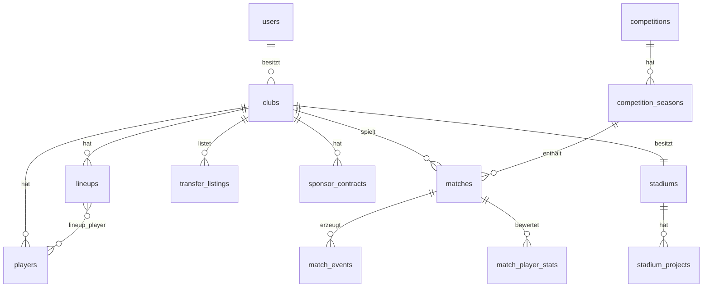

<div align="center">

# ⚽ BGFM — Browser Game Football Manager

**Eine vollständige Fußball-Manager-Simulation mit Ultra-Premium Dark-UI, Laravel 12 & Docker**

> [!IMPORTANT]
> **Neu: Match Center V4 & Premium Live-Ticker** — Radikal modernisierte Event-Darstellung, Echtzeit-Simulation mit AJAX und detaillierte Tor-Metadaten (Vorlage & Tor-Art).

[](https://laravel.com)
[](https://php.net)
[](https://mysql.com)
[](https://docker.com)
[](https://tailwindcss.com)

</div>

---

## 📋 Inhaltsverzeichnis

- [Features](#-features)
- [Tech Stack](#-tech-stack)
- [Schnellstart](#-schnellstart)
- [Demo-Zugänge](#-demo-zugänge)
- [Routen-Übersicht](#-routen-übersicht)
- [CLI-Befehle](#-cli-befehle)
- [Architektur](#-architektur)
- [Datenmodell](#-datenmodell)
- [Konfiguration](#-konfiguration)
- [Datenbankzugriff](#-datenbankzugriff)

---

## ✨ Features

<table>
<tr>
<td width="50%">

### 🏟️ Kernmodule
- **Vereine** — Profile mit Multi-Tab Ansicht, Budget, Reputation, Historie
- **Spieler** — Detail-Profile, Karrierehistorie, dynamisches Potenzial
- **Kader-Management** — Responsive Kaderliste, Bank-Slots, Positions-Rating
- **Premium UI** — Glassmorphismus, borderless Design, SVG Pitch-Visualisierung
- **Match Center V4** — Premium Ticker, Live-Simulation (AJAX), detaillierte Tor-Metadaten

</td>
<td width="50%">

### 💰 Wirtschaft & Transfers
- **Transfermarkt** — Listings, Gebote, Verhandlung
- **Leihmarkt** — Leihen mit optionaler Kaufoption
- **Verträge** — Verlängerungen mit Konditionen
- **Sponsoren** — Angebote, Verträge, Boni
- **Finanzbuchungen** — Einnahmen & Ausgaben

</td>
</tr>
<tr>
<td>

### 🏋️ Training & Infrastruktur
- **Training** — Sessions planen & Effekte anwenden
- **Trainingslager** — Planung, Kosten, Auto-Effekte
- **Stadion** — Kapazität, Infrastrukturprojekte, Upgrades
- **Stadionumfeld** — Erweiterungen & Fortschritt

</td>
<td>

### ⚙️ System & Automatisierung
- **Rollenmodell** — Admin / User mit ACP
- **CPU-Teams** — Automatische Aufstellung & Taktik
- **Spieltag-Runner** — Automatisierte Simulation
- **Saisonabschluss** — Auf-/Abstieg zwischen Ligen
- **Transferfenster** — Steuerbar per ENV
- **Benachrichtigungen** — In-Game Alerts

</td>
</tr>
</table>

---

## 🛠 Tech Stack

| Komponente | Technologie |
|:-----------|:------------|
| **Backend** | Laravel 12 · PHP 8.5 |
| **Datenbank** | MySQL 8.4 |
| **Frontend** | Blade · Tailwind CSS · Vite |
| **Auth** | Laravel Breeze |
| **Infrastruktur** | Docker Compose · Laravel Sail |

---

## 🚀 Schnellstart

### Voraussetzungen

- [Docker Desktop](https://www.docker.com/products/docker-desktop) installiert
- [Node.js](https://nodejs.org/) (für Frontend-Build)

### Installation

```bash
# 1. Repository klonen
git clone https://github.com/ta1896/BGFM.git
cd BGFM

# 2. Container starten
./vendor/bin/sail up -d

# 3. Datenbank einrichten (Migrationen + Seed-Daten)
./vendor/bin/sail artisan migrate:fresh --seed

# 4. Frontend bauen
npm install && npm run build

# 5. App öffnen
open http://localhost
```

---

## 🔑 Demo-Zugänge

| Rolle | E-Mail | Passwort |
|:------|:-------|:---------|
| 👤 User | `test@example.com` | `password` |
| 🛡️ Admin | `admin@example.com` | `password` |

---

## 🗺 Routen-Übersicht

<details>
<summary><strong>Öffentlich & Auth</strong></summary>

| Route | Beschreibung |
|:------|:------------|
| `/` | Startseite |
| `/login` | Anmelden |
| `/register` | Registrieren |

</details>

<details>
<summary><strong>Hauptmodule</strong></summary>

| Route | Beschreibung |
|:------|:------------|
| `/dashboard` | Zentrale Management-Übersicht |
| `/clubs/{id}` | Klub-Profil (News, Kader, Statistiken) |
| `/players/{id}` | Spieler-Profil (Attribute, Karriere, Status) |
| `/players` | Kader-Übersicht (Gelistet nach Positionen) |
| `/lineups` | Taktik-Editor & Spielfeld-Visualisierung |
| `/matches` | Globales Match-Center (Liga, Pokal, Testspiele) |
| `/matches/{id}` | Live-Matchcenter & Simulation |
| `/table` | Dynamische Ligatabelle (Historie verfügbar) |
| `/acp/ticker-templates` | ACP: Verwaltung der Liveticker-Vorlagen |

</details>

<details>
<summary><strong>Wirtschaft & Transfers</strong></summary>

| Route | Beschreibung |
|:------|:------------|
| `/transfers` | Transfermarkt |
| `/loans` | Leihmarkt |
| `/contracts` | Vertragsmanagement |
| `/sponsors` | Sponsoren |
| `/finances` | Finanzbuchungen |

</details>

<details>
<summary><strong>Training & Infrastruktur</strong></summary>

| Route | Beschreibung |
|:------|:------------|
| `/training` | Trainingsplanung |
| `/training-camps` | Trainingslager |
| `/stadium` | Stadionverwaltung |
| `/notifications` | Benachrichtigungen |

</details>

<details>
<summary><strong>Administration</strong></summary>

| Route | Beschreibung |
|:------|:------------|
| `/acp` | Admin Control Panel |

</details>

---

## 💻 CLI-Befehle

### Spieltag simulieren

```bash
# Alle fälligen Spiele
sail artisan game:process-matchday

# Bestimmte Liga-Saison
sail artisan game:process-matchday --competition-season=1
```

### Statistik-Rebuild

```bash
# Komplett (Liga + Spieler)
sail artisan game:rebuild-statistics --all

# Gezielt mit Integritäts-Audit
sail artisan game:rebuild-statistics --competition-season=1 --audit
```

### Backfill Spieler/Vereine

```bash
# Dry-Run (keine Änderungen)
sail artisan game:backfill-player-club-model --dry-run

# Mit Persistenz
sail artisan game:backfill-player-club-model --chunk=500
```

---

## 🏗 Architektur

```
app/
├── Http/Controllers/     # Dashboard + CRUD-Controller
├── Models/
│   ├── Club.php           # Verein: Budget, Reputation, Fan-Stimmung
│   ├── Player.php         # Kaderdaten + Leistungswerte
│   └── Lineup.php         # Formation + aktive Aufstellung
├── Services/
│   ├── MatchEngine/                  # Neue modulare Match-Engine
│   │   ├── LiveMatchTickerService.php # Orchestrator für Live-Matches
│   │   ├── ActionEngine.php           # Simulation von Toren, Fouls, Karten
│   │   ├── NarrativeEngine.php        # Dynamische Text-Generierung via Templates
│   │   ├── SubstitutionManager.php    # Komplexes Auswechslungssystem
│   │   └── LiveStateRepository.php    # DB-Operations für Live-Stats
│   ├── TeamStrengthCalculator.php    # Teamstärke (ATK/MID/DEF/Chemie)
│   ├── SeasonProgressionService.php  # Spieltag-Lauf, Auf-/Abstieg
│   ├── CpuClubDecisionService.php    # CPU-Aufstellung & Taktik
│   ├── FinanceCycleService.php       # Matchday-Finanzen
│   ├── SponsorService.php            # Sponsorangebote & Verträge
│   ├── StadiumService.php            # Stadion-Upgrades
│   └── TrainingCampService.php       # Trainingslager-Effekte
└── ...
resources/views/          # Blade Templates (responsive Dark UI)

---

## 🏟️ Match Center V4 - Das Herzstück

Das Match Center wurde in Version 4 grundlegend überarbeitet, um eine immersive, tv-reife Simulationserfahrung zu bieten.

### ⚡ Hauptfeatures
- **Premium Event-Cards**: Symmetrische Header-Designs für Tore und Karten mit integrierten Zeit-Bubbles.
- **Detaillierte Tor-Metadaten**: Automatische Erkennung von Tor-Arten (Kopfball, Fernschuss, Elfmeter) und Erfassung des Vorlagengebers.
- **Smart Update Polling**: Ein 10-Sekunden Intervall mit Change-Detection verhindert unnötiges Flackern der UI.
- **AJAX Live-Simulation**: Spiele können ohne Neuladen der Seite im Hintergrund simuliert werden.
- **Milestone Cards**: Besondere visuelle Hervorhebung von Anpfiff, Halbzeit und Abpfiff.
- **Smarte Zeit-Logik**: Dynamische Berechnung der Position von Zeit-Bubbles und Narrativen für maximale Lesbarkeit.
```

---

## 📊 Datenmodell



### Zusätzliche Tabellen

<details>
<summary>Vollständige Tabellenliste</summary>

**Kern:** `countries` · `competitions` · `seasons` · `competition_seasons`

**Registrierung:** `season_club_registrations` · `season_club_statistics`

**Spiele:** `matches` · `match_events` · `match_player_stats` · `match_financial_settlements`

**Transfers:** `player_contracts` · `transfer_listings` · `transfer_bids`

**Finanzen:** `club_financial_transactions` · `sponsors` · `sponsor_contracts`

**Infrastruktur:** `stadiums` · `stadium_projects` · `training_camps`

**Training:** `training_sessions` · `training_session_player`

**System:** `game_notifications` · `simulation_settings`

</details>

---

## ⚙️ Konfiguration

### Transferfenster

```env
# In .env aktivieren/deaktivieren
TRANSFER_WINDOW_ENFORCED=true
```

Fensterdefinitionen: `config/transfer.php`

### Simulation

Alle Simulationsparameter (Position-Fit, Scheduler, Bankspieler etc.) können über das **Admin Control Panel** unter `/acp/simulation/settings` konfiguriert werden.

---

## 🗄 Datenbankzugriff

| Parameter | Wert |
|:----------|:-----|
| Host | `127.0.0.1` |
| Port | `3306` |
| Datenbank | `laravel` |
| User | `sail` |
| Passwort | `password` |

```bash
sail mysql
```

---

<div align="center">

**Made with ❤️ and Laravel**

</div>
