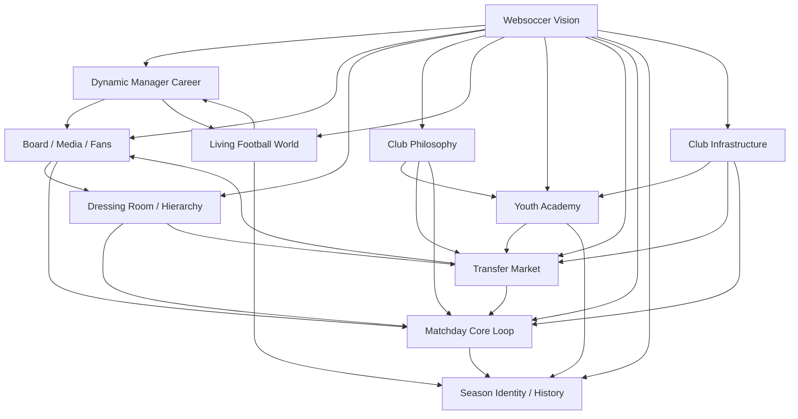
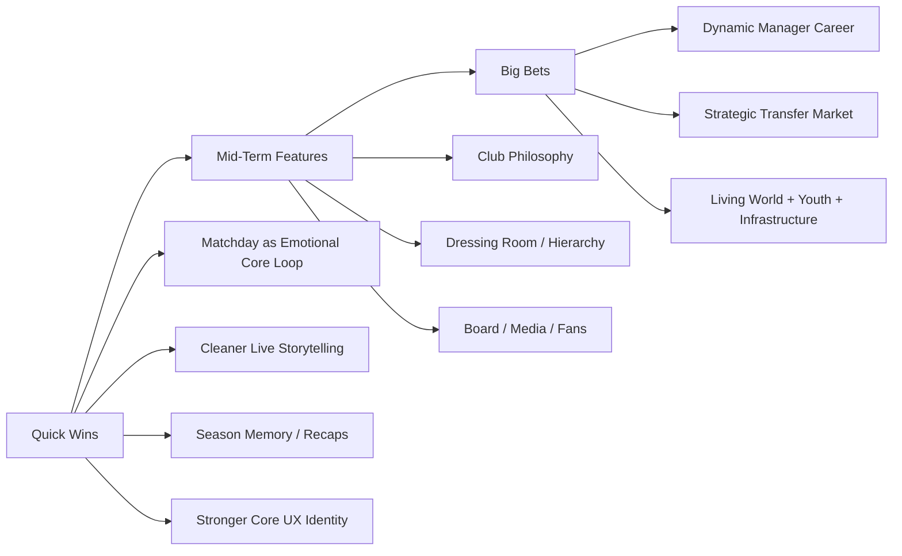
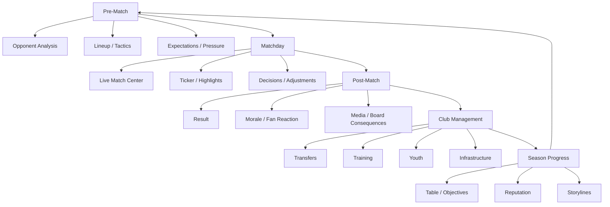

# Websoccer Infografiken

Diese Datei fasst die strategische Richtung von NewGen / Websoccer in 3 GitHub-tauglichen Infografiken zusammen.

Sie ist bewusst so aufgebaut, dass sie:

- direkt in GitHub sauber lesbar ist
- als schnelle Produktuebersicht funktioniert
- intern fuer Planung, Diskussion und Priorisierung nutzbar ist

---

## 1. Produkt-Map

Diese Grafik zeigt die 10 Kernkonzepte als zusammenhaengendes System statt als lose Featureliste.

### Aussage

- Das Spiel sollte nicht aus isolierten Modulen bestehen.
- Die staerkste Richtung ist ein zusammenhaengendes Manager-Oekosystem.
- Matchday, Karriere, Transfers, Jugend und Clubentwicklung greifen direkt ineinander.

---

## 2. Roadmap-Logik

Diese Grafik zeigt, wie die Themen nach Umsetzungslogik priorisiert werden koennen.

### Aussage

- Erst die Kernschleife staerken.
- Danach Management-Tiefe erweitern.
- Danach die grossen Langzeitsysteme ausrollen.

### Priorisierungsprinzip

| Phase | Fokus | Warum |
| --- | --- | --- |
| Quick Wins | Match-Erlebnis und UX | Hoher Impact bei vergleichsweise geringerem Risiko |
| Mid-Term | Manager-Tiefe | Macht Entscheidungen relevanter und Clubs unterscheidbarer |
| Big Bets | Langzeit-Identitaet | Schafft echte Produkt-DNA und Langzeitbindung |

---

## 3. Manager-Kernschleife

Diese Grafik zeigt, wie sich ein starker Spielrhythmus anfuehlen sollte.

### Aussage

- Der Spieltag ist das emotionale Zentrum.
- Alles andere sollte diese Schleife staerken, nicht ersetzen.
- Wenn diese Loop stark ist, traegt sie fast das gesamte Spiel.

---

## Kurzfazit

Wenn man die gesamte Produktidee in 3 Saetze herunterbricht:

1. Websoccer sollte sich wie eine lebendige Fussballwelt anfuehlen, nicht nur wie ein Verwaltungsmenue.
2. Der Spieltag muss emotional und visuell das Herz des Spiels sein.
3. Karriere, Transfers, Jugend und Clubidentitaet muessen langfristig zu einer grossen Managerreise verschmelzen.

---

## Empfehlte Nutzung auf GitHub

Diese Datei eignet sich gut fuer:

- `README`-Verlinkung
- interne Produktdiskussionen
- Issue-Planung
- Roadmap-Threads
- Discord-Posts mit GitHub-Link

### Sinnvolle Verlinkungen

- [`WEBSOCCER_10_KONZEPTE.md`](/c:/Users/akden/Documents/NewGen/docs/WEBSOCCER_10_KONZEPTE.md)
- [`README.md`](/c:/Users/akden/Documents/NewGen/README.md)
